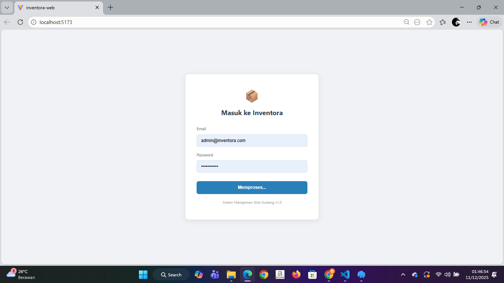
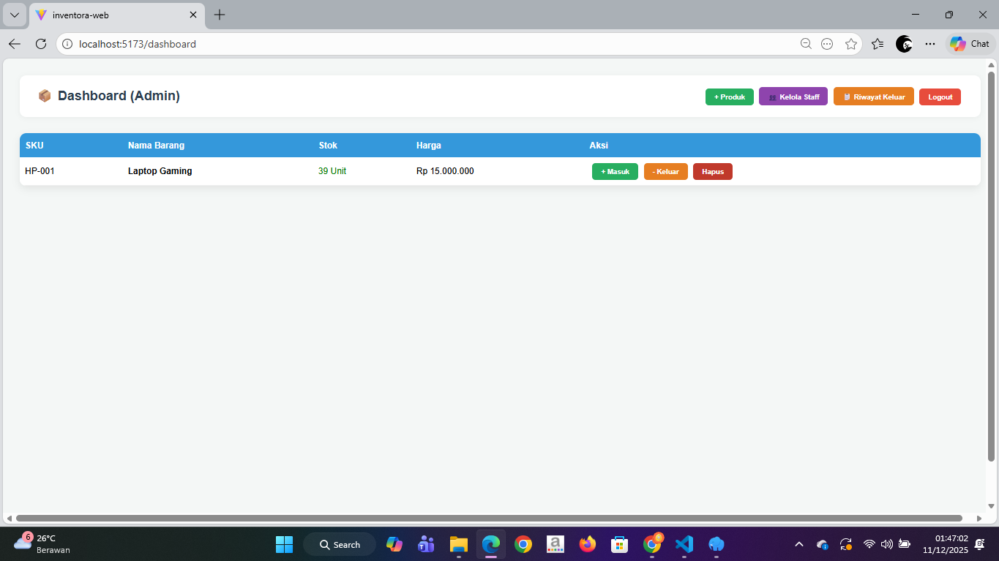
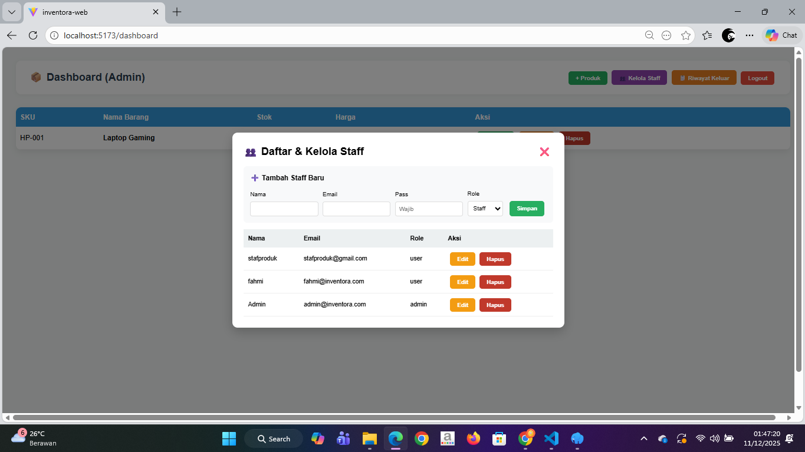
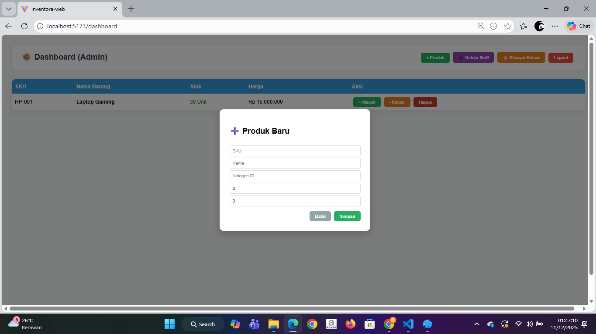
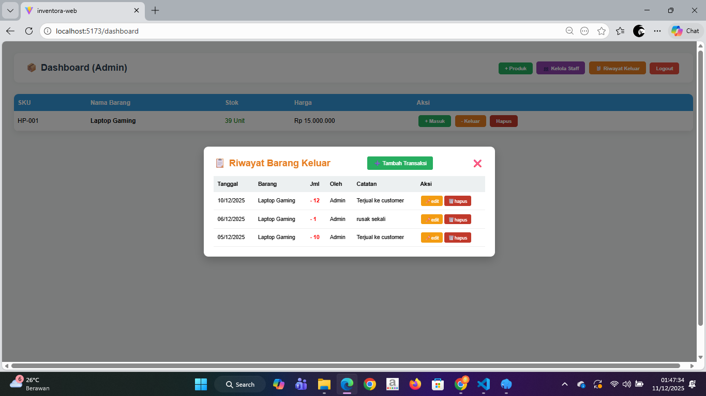
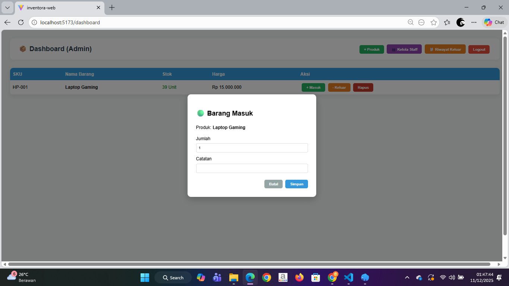

# Proyek Akhir: Sistem Manajemen Inventaris 

## Nama : Fahmi Hakim
## NIM : G.211.23.0019
## Mata Kuliah : Rekayasa Web

---

## Gambaran Umum Proyek

Aplikasi ini merupakan implementasi sistem **Full-Stack** yang dibangun menggunakan **Laravel API** dan **ReactJS Frontend**. Proyek ini berfokus pada pemenuhan ketentuan CRUD API pada 3 tabel wajib, dengan prioritas pada **integritas data** dan **keamanan sistem** melalui kontrol akses.

### Fitur Kunci Aplikasi

* **CRUD Produk & Staff:** Manajemen penuh data inventaris dan pengguna.
* **Riwayat Transaksi:** Pencatatan detail barang masuk (`barangmasuk.png`) dan barang keluar (`riwayatbarangkeluar.png`).
* **Otorisasi Role:** Kontrol akses untuk membatasi fungsi sensitif hanya pada Admin.
* **Integritas Stok:** Logika *atomic transaction* pada Backend untuk menjamin stok akurat.

---

## 📸 Tampilan Aplikasi (Screenshots)

Berikut adalah antarmuka utama dari sistem inventaris (sesuai penamaan file):

| Deskripsi Tampilan | Screenshot |
| :--- | :--- |
| **Halaman Login** |  |
| **Dashboard Utama (Daftar Produk)** |  |
| **Modal Kelola Staff (CRUD Tabel 2)** |  |
| **Modal Tambah Produk Baru** |  |
| **Modal Riwayat Barang Keluar (Tabel 3)** |  |
| **Form Barang Masuk** |  |

---

## 🔑 Implementasi Kunci & Pemenuhan Ketentuan

1.  **CRUD API & Autentikasi:** API sepenuhnya mendukung CRUD dan diamankan menggunakan Autentikasi token.
2.  **3 Tabel Wajib:** Fungsionalitas CRUD diimplementasikan pada **Users (Staff)**, **Products**, dan **Transactions**, dibuktikan pada file migrasi (`create_products_table`, `create_transactions_table`, dll.).
3.  **Integrasi Penuh:** Frontend ReactJS sepenuhnya mengonsumsi dan menampilkan data dari API Laravel.
4.  **Integritas Data:** Logika di *Transaction Controller* memastikan stok di-update secara aman dan memiliki fitur Rollback stok.

---

## 🛠️ Cara Instalasi (Lokal)

Proyek terdiri dari dua bagian (`inventora-api` dan `inventora-web`).

### 1. Backend (inventora-api)

1.  Masuk ke direktori: `cd inventora-api`
2.  Instal dependensi: `composer install`
3.  Setup DB: Atur koneksi di file `.env`
4.  Jalankan migrasi: `php artisan migrate`
5.  Jalankan server: `php artisan serve`

### 2. Frontend (inventora-web)

1.  Masuk ke direktori: `cd inventora-web`
2.  Instal dependensi: `npm install`
3.  Jalankan aplikasi: `npm run dev`
